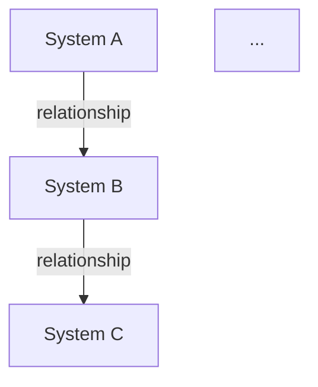
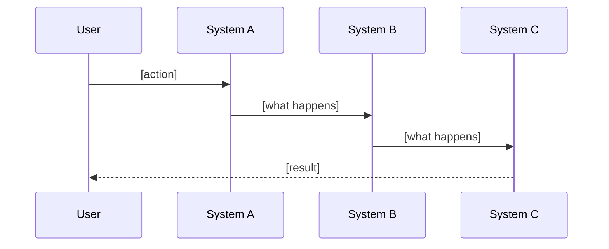

# Study Guide Output Template

Use this structure when writing the guide. Adapt section depth to the codebase's complexity, but preserve the ordering — it follows the pedagogical progression from purpose to patterns to practice.

---

## Template

```markdown
# [Project Name]: A Study Guide

## 1. Why This Exists

**The problem:** [What real-world problem does this solve? Who has this problem? What happens without this software?]

**The approach:** [In 2-3 sentences, how does this project solve that problem? What's the core insight or strategy?]

**Who uses it and how:** [End users, developers, other systems — what does success look like from their perspective?]

> **Before continuing:** Can you explain to someone else, in one sentence, why this project exists? If not, re-read this section. Everything that follows is in service of this purpose.

---

## 2. The Big Ideas

The concepts that, once understood, make the rest of the codebase click.

### [Threshold Concept 1: e.g., "Everything is an Event"]

[2-3 paragraph explanation of what this means, why it matters, and how it manifests throughout the codebase. Include a concrete example.]

**You'll see this in:** [List 3-4 places in the code where this concept is visible, with file paths]

### [Threshold Concept 2]

[Same structure]

### [Threshold Concept 3, if applicable]

[Same structure]

> **Self-test:** Close this guide and explain each big idea in your own words. What would break if any of these concepts were violated?

---

## 3. System Map

A bird's-eye view of the primary systems and how they relate.



### How to Read This Map

[Brief orientation: where requests enter, which direction data flows, what the major boundaries are]

| System | Purpose | Key Files |
|--------|---------|-----------|
| [Name] | [One-line purpose] | `path/to/entry.ts` |
| ... | ... | ... |

> **Exploration task:** Before reading further, pick any two connected systems on the map and find where they communicate in the code. What function/method/event connects them?

---

## 4. Walking Through a Request

A worked example tracing a representative operation end-to-end.

### [Operation name, e.g., "User creates a new project"]



**Step 1: [Entry point]**

```[language]
// path/to/file.ts:XX
[relevant code snippet, 5-15 lines]
```

[Annotation: what this does and WHY — not just restating the code. "This validates input before passing to the service layer because [reason]. Notice it uses [pattern] — this is the [Pattern Name] (see: [link])."]

**Step 2: [Next stage]**

[Same structure: code snippet + annotated reasoning]

**Step 3: [Continue through the flow]**

[Continue until the operation completes]

> **Predict & verify:** Pick a different operation (e.g., [suggest one]). Before tracing it, predict which systems it will touch and in what order. Then trace it. Where were you right? Where were you surprised?

---

## 5. System Deep Dives

One section per primary system, ordered by dependency (systems with fewer dependencies first).

### 5.X [System Name]

**Purpose:** [Why does this system exist? What problem does it solve within the larger architecture?]

**Pattern:** [Name the architectural pattern] — [one-line explanation]. [Learn more]([link to canonical resource]).

**Key abstractions:**

| Abstraction | Role | Location |
|-------------|------|----------|
| [Class/module/concept] | [What it represents] | `path/to/file` |
| ... | ... | ... |

**How it works:**

[Concise explanation of the system's internal mechanics. Focus on the non-obvious. Include a small code example if helpful.]

**Interfaces:**

- **Receives from [System X]:** [What data/events, through what mechanism]
- **Sends to [System Y]:** [What data/events, through what mechanism]

**Design tradeoff:** [Name a specific tradeoff this system makes and why]

> **Why this way?** [Elaborative interrogation prompt: "Why does this system use [approach A] instead of [obvious alternative B]?" The answer should illuminate a real constraint — performance, consistency, team preference, historical reason.]

> **Explore:** [PRIMM-style task: "Find the function that handles [X]. Before reading it, predict what parameters it takes. Then read it. Modify it to also [Y] and run the tests."]

---

## 6. Patterns & Conventions

Recurring patterns across the codebase. Recognizing these is the difference between reading code and understanding it.

### [Pattern Name]

**What it is:** [One-line description]
**Where it appears:** [List locations]
**Why it's used here:** [Specific reason for this codebase]
**Learn more:** [Link to canonical resource — Martin Fowler, relevant docs, original paper]

### [Next pattern]

[Same structure]

### Naming Conventions

| Convention | Example | Meaning |
|------------|---------|---------|
| [e.g., `*Service`] | `UserService` | [Business logic for a domain entity] |
| ... | ... | ... |

---

## 7. Boundaries & External Systems

How this codebase interacts with the outside world.

| External System | Purpose | Integration Point | Pattern |
|----------------|---------|-------------------|---------|
| [Database] | [Role] | `path/to/adapter` | [Repository / Active Record / etc.] |
| [API] | [Role] | `path/to/client` | [SDK / REST client / etc.] |
| ... | ... | ... | ... |

**Error handling philosophy:** [How does the codebase handle failures at boundaries? Retries? Circuit breakers? Fail-fast?]

---

## 8. Testing Strategy

How the codebase verifies correctness and what the tests reveal about intended behavior.

**Test structure:** [Where tests live, how they're organized, what framework is used]

**What to read first:** [Which test files best reveal system behavior? Integration tests often tell more than unit tests for understanding.]

> **Explore:** Run the test suite. Pick a failing test (or break one deliberately). Trace the failure back to the source. This exercise builds the debugging mental model faster than reading code.

---

## 9. Your Next Steps

A scaffolded learning progression — each step removes support and increases independence.

### Day 1: Guided Exploration
- [ ] Read Sections 1-3 (purpose, big ideas, system map)
- [ ] Complete the system map exploration task
- [ ] Trace the worked example in Section 4 in your editor/debugger

### Day 2: Supported Investigation
- [ ] Complete the "predict & verify" task from Section 4
- [ ] Read 2-3 system deep dives most relevant to your work
- [ ] Complete their exploration tasks

### Day 3: Independent Practice
- [ ] Reconstruct the system map from memory, then compare
- [ ] Trace a new operation end-to-end without guidance
- [ ] Find and read a test that teaches you something about intended behavior

### Day 4+: Making It Yours
- [ ] Fix a small bug or implement a minor feature
- [ ] Identify a pattern you haven't named yet — name it
- [ ] Explain a system to someone else (or write it up)
```

## Adaptation Notes

- **Small codebases (<10 files):** Collapse Sections 3-5 into a single walkthrough. Skip Section 7 if no external systems.
- **Monorepos / large codebases:** Scope to one service or package. Mention neighboring systems in Section 7 but don't deep-dive them.
- **Specific subsystem focus:** Start at Section 5 for the target system, but include Sections 1-2 as compressed context.
- **Architecture-only depth:** Sections 1-3 and 6, skip deep dives and exploration tasks.
