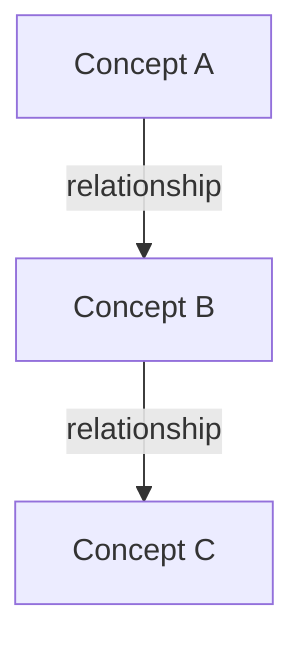
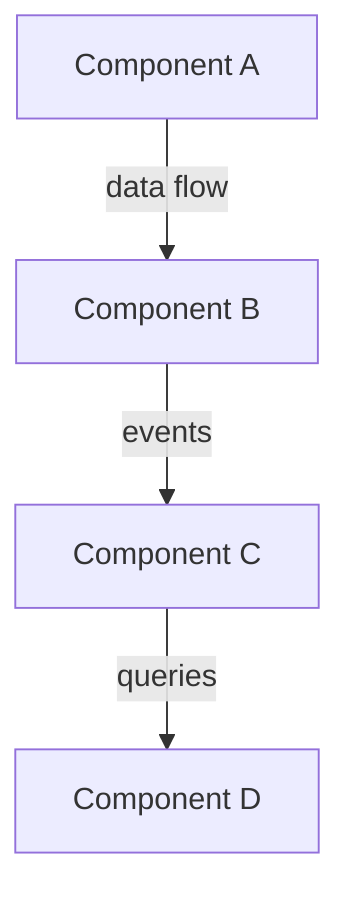
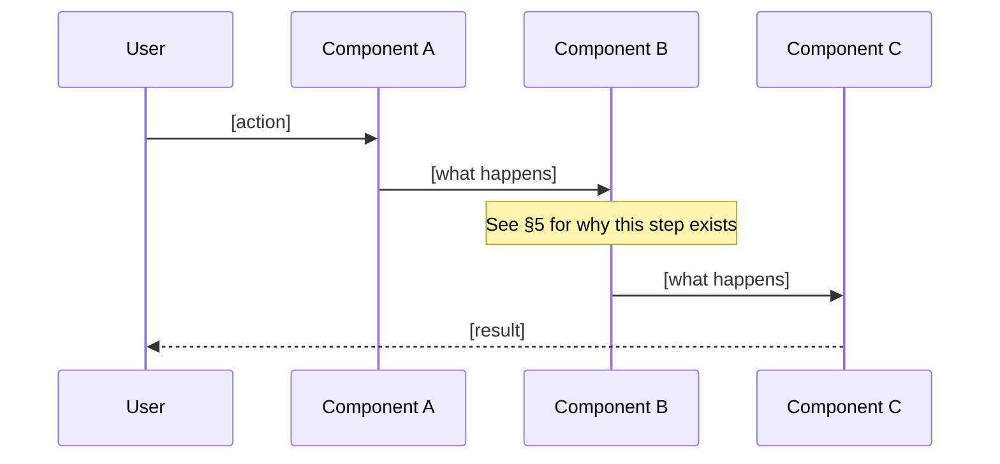

# Literate Guide Output Template

Use this structure as a foundation. The section numbering, cross-references, and narrative flow are essential. Adapt the depth and number of sections to the codebase, but preserve the progression: motivation → domain → design → implementation → connections.

---

## Template

```markdown
# [Project/Feature Name]: A Literate Guide

> *A narrative walkthrough of [project/feature], explaining what the code does and why it was built this way. Sections are ordered for understanding, not by file structure. Cross-references using the § symbol (e.g., §3, §12) connect related ideas throughout.*

---

## §1. The Problem

[What problem does this software solve? Who has this problem? What did the world look like before this code existed? Be concrete — name the pain point, the user, the situation.]

[If there's a key insight or approach that defines the solution, introduce it here. This is the thesis statement of the guide.]

---

## §2. The Domain

[What are the core concepts? Map the vocabulary of the problem domain to the abstractions in the code. This section gives the reader the mental model they need before encountering any implementation.]

[Include a diagram if the domain has relationships worth visualizing:]



[Explain each concept briefly. Focus on what it represents in the real world, not how it's implemented — that comes later.]

---

## §3. The Shape of the System

[Bird's-eye view of the architecture. How do the major components relate? Where are the boundaries?]



[Explain the architecture briefly. Name the pattern if one applies (hexagonal, event-driven, layered, etc.) and say why it was chosen. This is a design decision — treat it as one.]

---

## §4–N. The Narrative Sections

[Each section follows this rhythm:]

### §N. [Idea Name — describes the concept, not the file]

[Prose introducing the idea. Why does this matter? How does it connect to what we've seen so far?]

```[language]
// path/to/file.ext:LL-LL
[relevant code excerpt, trimmed to the essential lines]
```

[Annotation: what to notice in this code. Point out the significant details, the non-obvious choices, the connection to other sections.]

[Design reasoning: "We use X here rather than Y because..." or "This was refactored from Z when we discovered..." Include alternatives considered if known.]

[Transition — every section must end by bridging to the next. Examples: "With [concept] established, we can now look at how [next concept] builds on it (§N+1)." or "This connects back to [earlier concept] (§M) because..." or "This raises a natural question: how does [next topic] handle [edge case]? That's §N+1."]

---

## §N+1. How It All Fits Together

[A worked example tracing a complete operation through the sections you've described. This is where the reader sees the narrative come alive as a running system.]

### [Operation name, e.g., "A user submits a query"]



[Walk through each step with brief code excerpts and cross-references to the sections that explain each component in depth.]

---

## §N+2. The Edges

[Edge cases, error handling, and the hard parts. What breaks? What's fragile? What took the most iteration to get right?]

[These are often the most interesting sections — they reveal the real-world constraints that shaped the design.]

---

## §Last. Looking Forward

[What would change if the system needed to evolve? Where are the extension points? What assumptions might not hold?]

[This section is honest about limitations and open questions. It respects the reader enough to show the seams.]

---

*§-index: [list each section number and name for quick navigation]*
```

## Adaptation Notes

- **Small codebases (<10 files):** Fewer sections, but maintain the narrative voice and cross-references. Even a small program has a story.
- **Single feature:** Start at §1 with the feature's motivation, not the whole project. Reference the broader system only where the feature touches it.
- **Large codebases:** Scope aggressively. A literate guide that tries to cover everything covers nothing well. Pick the most important subsystem or the most interesting architectural thread.
- **Recent change or PR:** §1 is "what was wrong / what needed to change." The narrative follows the change through the system, explaining each modification and why it was necessary.

## What Makes a Great Literate Guide

1. **You can read it in order.** Each section builds on the previous one. No forward dependencies that leave the reader confused.
2. **The code serves the prose.** Every excerpt illustrates a specific point. If you removed the code, the prose would have a gap; if you removed the prose, the code would be meaningless.
3. **Design decisions are explicit.** The reader knows not just what was built, but what was *not* built and why.
4. **Cross-references form a web.** Concepts introduced early are referenced later. The reader sees the same abstractions from multiple angles.
5. **It sounds like a person wrote it.** Not generated, not formal, not dry. A thoughtful author explaining their work to a curious reader.
